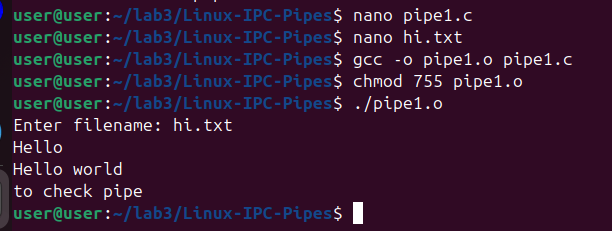
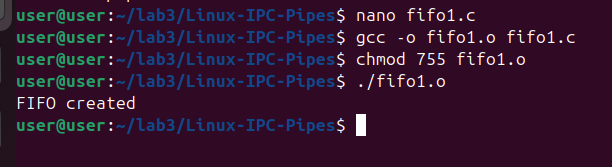

# Linux-IPC--Pipes
Linux-IPC-Pipes


# Ex03-Linux IPC - Pipes

# AIM:
To write a C program that illustrate communication between two process using unnamed and named pipes

# DESIGN STEPS:

### Step 1:

Navigate to any Linux environment installed on the system or installed inside a virtual environment like virtual box/vmware or online linux JSLinux (https://bellard.org/jslinux/vm.html?url=alpine-x86.cfg&mem=192) or docker.

### Step 2:

Write the C Program using Linux Process API - pipe(), fifo()

### Step 3:

Testing the C Program for the desired output. 

# PROGRAM:


## C Program that illustrate communication between two process using unnamed pipes using Linux API system calls
```
#include <stdio.h>
#include <stdlib.h>
#include <sys/types.h>
#include <sys/stat.h>
#include <string.h>
#include <fcntl.h>
#include <unistd.h>
#include <sys/wait.h>

void server(int, int);
void client(int, int);

int main() {
    int p1[2], p2[2], pid;
    pipe(p1);
    pipe(p2);
    pid = fork();

    if (pid == 0) {
        close(p1[1]); // child closes write end of pipe1
        close(p2[0]); // child closes read end of pipe2
        server(p1[0], p2[1]);
        exit(0);
    }

    close(p1[0]); // parent closes read end of pipe1
    close(p2[1]); // parent closes write end of pipe2
    client(p1[1], p2[0]);
    wait(NULL);
    return 0;
}

void server(int rfd, int wfd) {
    int n;
    char fname[2000], buff[2000];
    n = read(rfd, fname, 2000);
    fname[n] = '\0';
    int fd = open(fname, O_RDONLY);
    if (fd < 0)
        write(wfd, "can't open", 9);
    else {
        n = read(fd, buff, 2000);
        write(wfd, buff, n);
        close(fd);
    }
}

void client(int wfd, int rfd) {
    int n;
    char fname[2000], buff[2000];
    printf("Enter filename: ");
    scanf("%s", fname);
    write(wfd, fname, 2000);
    n = read(rfd, buff, 2000);
    buff[n] = '\0';
    write(1, buff, n);
}
```


## OUTPUT

##PROGRAM
## C Program that illustrate communication between two process using named pipes using Linux API system calls
```
#include <unistd.h>
#include <stdlib.h>
#include <stdio.h>
#include <sys/types.h>
#include <sys/stat.h>
int main(){
int res = mkfifo("/tmp/my_fifo", 0777);
if (res == 0) printf("FIFO created\n");
exit(EXIT_SUCCESS);
}
```


## OUTPUT


# RESULT:
The program is executed successfully.
